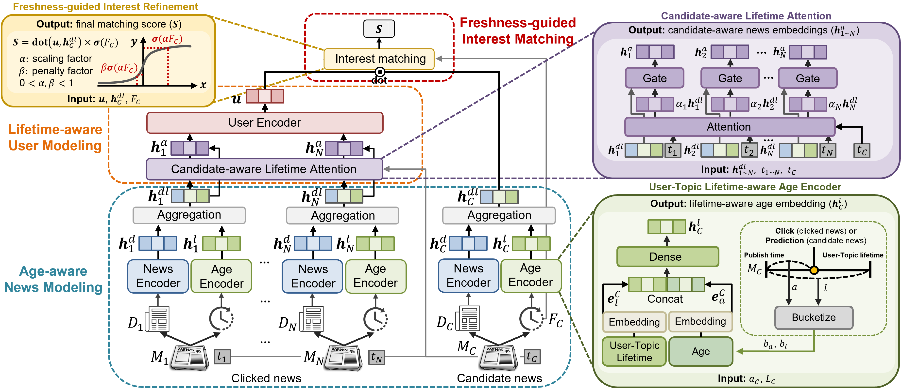

# [CIKM'25] Is This News Still Interesting to You?: Lifetime-aware Interest Matching for News Recommendation
This repository provides an implementation of *LIME* as described in the paper: [Is This News Still Interesting to You?: Lifetime-aware Interest Matching for News Recommendation]
<!--(https://arxiv.org/abs/2310.09401) by Seongeun Ryu, Yunyong Ko, and Sang-Wook Kim, In Proceedings of the ACM International Conference on Information and Knowledge Management (CIKM) 2025 -->

## The overview of LIME


## Available dataset
1. [MIND Dataset](https://msnews.github.io/)
2. [Adressa Dataset](https://reclab.idi.ntnu.no/dataset/)

## Datasets
|Datasets|# of Users|# of News|Avg. title len|Avg. body len|
|:---:|:---:|:---:|:---:|:---:|
|MIND|94,057|65,238|11.67|41.01|
|Adressa|601,215|73,844|6.63|552.15|

## Dependencies
Our code runs on the Intel i7-9700k CPU with 64GB memory and NVIDIA RTX 2080 Ti GPU with 12GB, with the following packages installed:
```
python 3.10.16
torch 2.0.1
torchtext 0.15.2
pandas
numpy
argparse
sklearn
```
## How to run
```
python main.py --news_encoder=LIME --content_encoder=CROWN --user_encoder=CROWN
```

## Citation
Please cite our paper if you have used the code in your work. You can use the following BibTex citation:
```
@inproceedings{ryu2025lime,
  title={Is This News Still Interesting to You?: Lifetime-aware Interest Matching for News Recommendation},
  author={Ryu, Seongeun and Ko, Yunyong and Kim, Sang-Wook},
  booktitle={Proceedings of the ACM International Conference on Information and Knowledge Management (CIKM) 2025},
  pages={xxxx--xxxx},
  year={2025}
}
```
